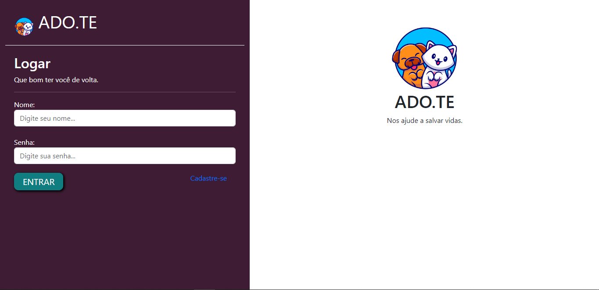
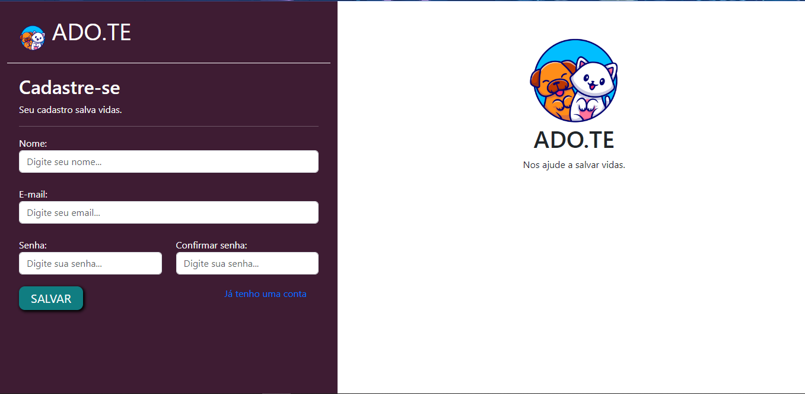
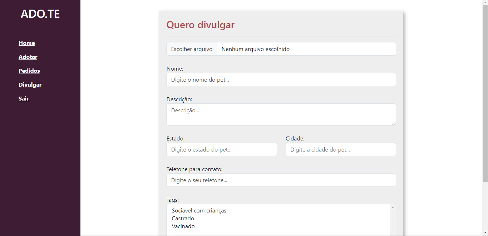
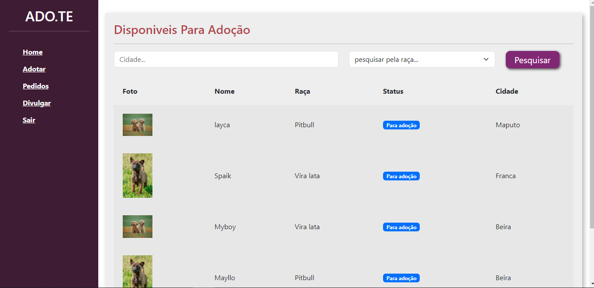
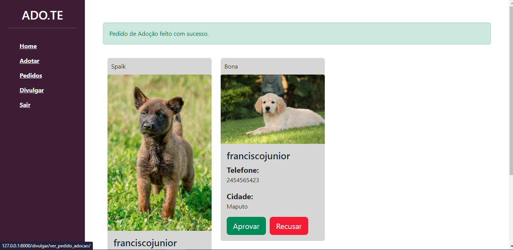
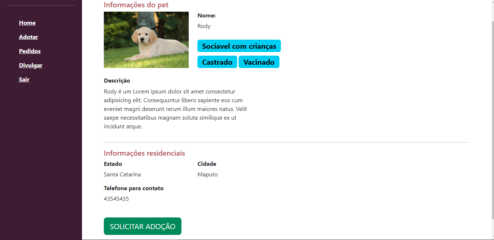

# Adote
Adote é uma aplicação web para conectar pessoas que têm animais para colocar em adoção e pessoas que querem adotar um animal.
 
 ## Tecnologias usadas
 

 
 ## Screenshorts do Layout da Aplicação
 
 
 
 
   
     
       

### OBS: sistema ainda em desenvolvimento.
